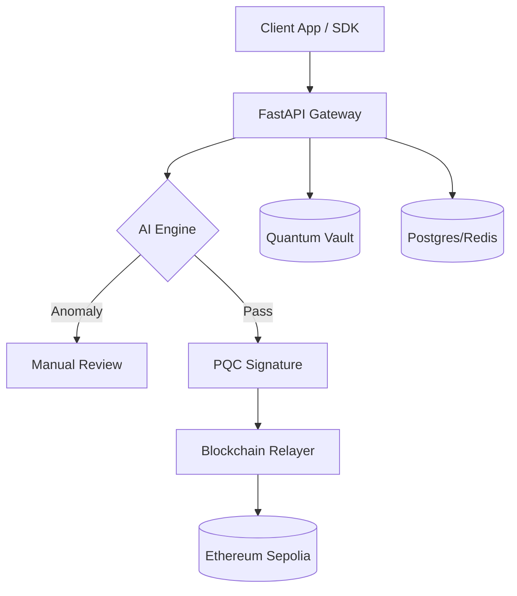

# 🌌 Q-AI Chain Protocol
### *Quantum-Secure AI-Powered Trust Protocol*

---

**Q-AI Chain** is a state-of-the-art modular protocol for identity verification, transaction security, and fraud prevention in a post-quantum world. 

[**Explore Setup Guide**](SETUP_GUIDE.md) | [**View SDK Docs**](sdk/README.md) | [**Architecture**](docs/architecture.md)

---

## 💎 Core Pillars

| 🧠 **AI Engine** | 🛡 **Quantum Security** | ⛓ **Blockchain Trust** |
| :--- | :--- | :--- |
| **Isolation Forest** anomaly detection detects fraud before it happens. | Integrated with **Dilithium2** and **Kyber** for PQ resistance. | Immutable anchoring of trust scores and identities on-chain. |

---

## 🏗 System Architecture

---

## 🚀 Key Features

- **PQC-DID Registry**: Decentralized identities secured by Post-Quantum Cryptography.
- **Real-Time Risk Scoring**: Dynamic risk assessment for every transaction.
- **Relayer Pathing**: Advanced on-chain anchoring with nonce-management and idempotency.
- **Developer First**: Fully typed FastAPI backend and a clean, lightweight JS SDK.

---

## 📂 Protocol Components

- 📜 **`contracts/`**: Solidity registries for Identity, Transactions, and Risk.
- ⚙️ **`backend/`**: Protocol logic featuring Dilithium/Kyber integration.
- 🧠 **`ai-engine/`**: Local AI artifacts for deterministic fraud detection.
- 🎨 **`frontend/`**: Premium Tailwind-powered dashboard for network monitoring.
- 📦 **`sdk/`**: Ethers.js v6 abstraction for third-party service integration.
- 🐳 **`infra/`**: Dockerized environment for instant local deployment.

---

> [!TIP]
> **Getting Started?**
> The safest way to deploy is through our specialized infrastructure! Check the `infra/` folder for one-command deployment.

---

Developed for a **secure, decentralized, and intelligent future**.

