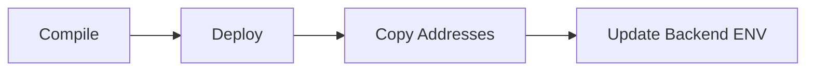

# ⚙️ Q-AI Chain Setup Guide
### *Strategic Step-by-Step Deployment Protocol*

---

> [!NOTE]
> **Prerequisites Checklist**
>
> | Platform | Requirement | Recommendation |
> | :--- | :--- | :--- |
> | **Node.js** | v18.0.0+ | LTS preferred |
> | **Python** | v3.9.0+ | with `venv` support |
> | **Docker** | v24.0.0+ | Docker Compose Desktop |
> | **Web3** | Sepolia RPC | Infura or Alchemy |

---

## 🔐 1. Identity & Security Configuration

The protocol uses `.env` files for secure component inter-communication. 

### **Environment Variable Matrix**

| Folder | Source File | Key Variable | Purpose |
| :--- | :--- | :--- | :--- |
| `backend/` | `.env.example` | `RELAYER_PRIVATE_KEY` | Account used for gas-anchoring. |
| `contracts/` | `.env.example` | `SEPOLIA_URL` | Your RPC node for deployment. |
| `frontend/` | `.env.example` | `VITE_API_URL` | The endpoint for your API. |

> [!IMPORTANT]
> **Relayer Security**: Never share your `RELAYER_PRIVATE_KEY`. This key handles on-chain gas costs for your anchoring service.

---

## ⛓ 2. Smart Contract Registry Deployment



1. **Enter the Registry**:
   ```bash
   cd contracts && npm install
   ```
2. **Compile and Launch**:
   ```bash
   npx hardhat compile
   # Deploy specifically to Sepolia
   npx hardhat run scripts/deploy.js --network sepolia
   ```
3. **Capture Outputs**: You will see three registry addresses. **Copy them now**.

---

## 🧠 3. AI Artifact Training

Before the protocol starts, its internal "brain" must be primed with local model artifacts.

1. **Activate Environment**:
   ```bash
   cd ai-engine
   python -m venv venv && source venv/bin/activate # Windows: venv\Scripts\activate
   pip install -r ../backend/requirements.txt
   ```
2. **Train & Save**:
   ```bash
   python training.py
   ```
   > [!SUCCESS]
   > This generates `artifacts/isolation_forest.joblib` and `artifacts/scaler.joblib`. **Do not delete these.**

---

## 🎨 4. Protocol Gateway & Dashboard

| Step | Component | Command | Result |
| :---: | :--- | :--- | :--- |
| **01** | **Database** | `alembic upgrade head` | Migrates trust identities & audits. |
| **02** | **Backend** | `uvicorn main:app --reload` | Gateway API starts on port `8000`. |
| **03** | **Frontend**| `npm run dev` | Dashboard launches on port `5173`. |

---

## 🐳 5. Infrastructure Automation (One-Click)

For a fully containerized deployment, use the **Infra Orchestrator**:

```bash
# From the project root
cd infra
docker compose up -d --build
```

---

> [!TIP]
> **Production Hardening**
> For public facing instances, always run the production Docker profile which enables the **Nginx Reverse Proxy** and **SSL/TLS** termination.

---

<div align="center">

**Protocol Active.** Proceed with integration.

</div>
